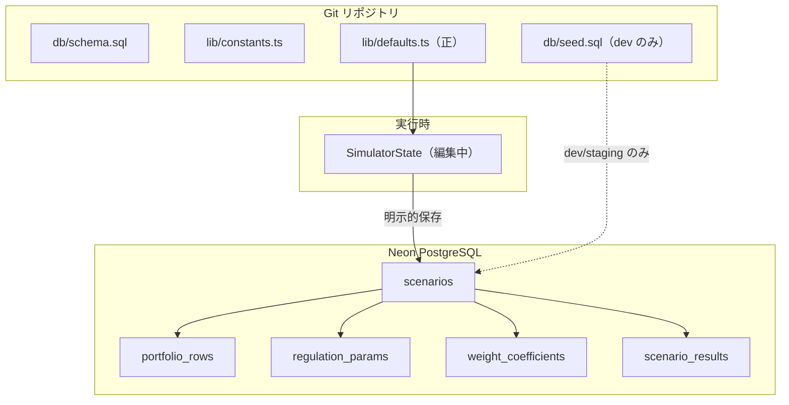
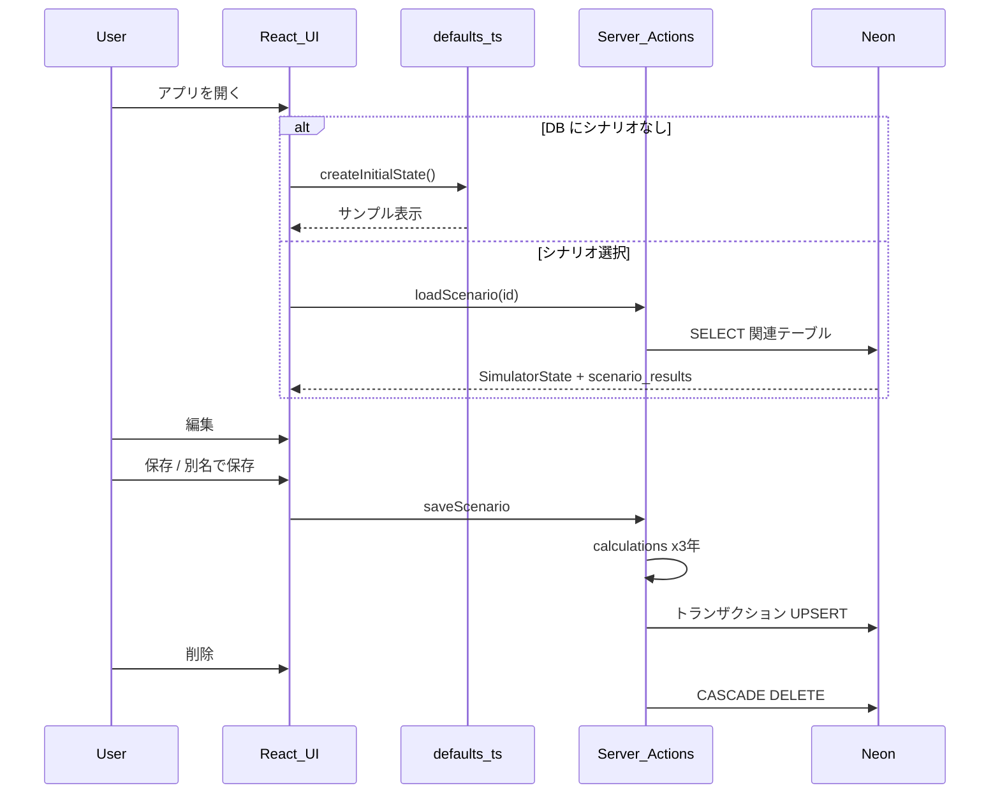

# 欧州CO₂シミュレーター — Phase 2 実装計画（計算・保存・デプロイ）

> **保存日**: 2026-06-11（2026-06-17 グリル追記、2026-07-02 AI実装グリル追記）  
> **関連**: [eu-co2-simulator-grill-decisions.md](./eu-co2-simulator-grill-decisions.md) §17（保存方針グリル合意）  
> **図解**: [co2-simulator-data-persistence.html](./co2-simulator-data-persistence.html)  
> **前提**: [eu-co2-simulator-ui-plan.md](./eu-co2-simulator-ui-plan.md) の UI フェーズは完了済み

---

## 1. Phase 2 のゴール

| 含める | 含めない（v1 対象外） |
|--------|------------------------|
| `lib/calculations.ts` 本番計算 + Pane3 連動 | localStorage 自動保存 |
| Neon PostgreSQL への名前付きシナリオ保存 | JSON エクスポート／インポート |
| 保存時に **3年分** の `scenario_results` を UPSERT | `ai_analyses` への INSERT |
| Basic 認証（Vercel 公開） | ユーザー別ログイン・データ分離 |
| シナリオ一覧・読込・上書き保存・別名保存・削除 | `.fia` ZIP |
| Pane4 本番 AI 接続（Phase 2 後半・`calculations.ts` 完成後） | LLM APIキー不要での本番品質出力 |

**v1 完成定義（§14 継承）**: 計算（重量補正・年次・仕様ロジック）＋ **DB 保存が正しく動く**こと。

---

## 2. データの置き場所



| 置き場所 | 中身 |
|----------|------|
| **Git** | スキーマ、プリセット定数、雛形生成（`defaults.ts`）、型変換（`db-types.ts`）、Neon 接続（`db.ts`） |
| **Git（dev のみ）** | `seed.sql` — ローカル／ステージング DB リセット用。**本番 Neon には流さない** |
| **Neon** | ユーザー保存シナリオ + 入力データ + 保存時点の3年分計算結果 |
| **メモリ** | 編集中の `SimulatorState`（保存ボタンまで DB 非反映） |

**二重化ルール**: サンプル数値の正は `lib/defaults.ts`。`seed.sql` を更新するときは defaults と数値を揃える。

---

## 3. ユーザー操作フロー



### 保存ルール（§17 確定）

- **書き込み**: 明示的「保存」のみ（自動保存なし）
- **上書き**: 読み込み中 ID に「保存」→ UPDATE / 「別名で保存」→ INSERT
- **計算結果**: 保存時に 2025・2027・2030 をサーバー計算 → `scenario_results` UPSERT
- **Pane3 表示**: 保存済み読込時は DB の `scenario_results`（選択年の行）。編集中は `calculations.ts` でリアルタイム再計算
- **Pane4**: 都度生成。DB 非保存
- **初回**: DB 空でも `defaults.ts` で表示。初回「保存」で Neon に1件目

---

## 4. 実装 TODO

### 4.0 Phase 1 クリーンアップ（Phase 2 着手前に実施）

§17（localStorage → PostgreSQL 移行）により、Phase 1 で作成した以下のコードが旧仕様の遺物となった。Phase 2 実装を始める前に削除する。

- [ ] `lib/constants.ts` の `STORAGE_KEY` を削除（旧 localStorage 用キー名。現在どこからも参照されていない）
- [ ] `lib/types.ts` の `PersistedSimulatorSnapshot` を削除（旧 localStorage 単一スナップショット型。新 Phase 2 の DB 保存は `SimulatorState` → `lib/db-types.ts` ヘルパー → DB テーブル行 の経路で行うため不要）

### 4.1 インフラ・認証

- [ ] Vercel デプロイ設定、`DATABASE_URL` 環境変数
- [ ] `middleware.ts` — Basic 認証（`BASIC_AUTH_USER` / `BASIC_AUTH_PASSWORD` 等）
- [ ] 本番 Neon に `schema.sql` 適用（`db/migrate.mjs` または手動）
- [ ] 本番では **seed.sql を実行しない**

### 4.2 計算

- [ ] `lib/calculations.ts` — §7 の式 + 重量補正 + 対象年連動
- [ ] 除算ガード: 実質排出量 = 0 のとき `achievementRatePercent = Infinity`。画面は **「≥100%」** 表示。DB 保存時のみ `null` に変換（2026-06-17 確定）
- [ ] 重量補正式: `effectiveTarget = targetGPerKm + a × (fleetAvgWeightKg − m0)`。係数初期値 `a=0.0333` / `M0=1377` は Pane2 詳細設定で手入力変更可（2026-06-17 確定）
- [ ] Pane3 表示は **常に `calculations.ts` でリアルタイム再計算**（isDirty 管理なし。DB の `scenario_results` は将来比較用の保存にとどめる）（2026-06-17 確定）
- [ ] `lib/selectors.ts` の `toCalculationInput` / `getDisplayTargetCo2` を本番接続
- [ ] Pane3 を state + calculations に接続（デモ Badge 削除）

### 4.3 永続化 API

- [ ] Server Actions（または Route Handlers）:
  - `listScenarios()` — id, name, updated_at
  - `loadScenario(id)` — `SimulatorState` + `scenario_results` 復元
  - `saveScenario(id | null, name, state)` — 入力テーブル + 3年分 results をトランザクション
  - `deleteScenario(id)`
- [ ] `lib/db-types.ts` の変換ヘルパーを使用
- [ ] 保存時: 既存 `portfolio_rows` 等は DELETE + INSERT または差分更新（実装時に単純な方を選択）

### 4.4 UI

- [ ] シナリオ選択 UI（ContextBar または AppHeader 付近）
- [ ] 「保存」「別名で保存」「新規」「削除」ボタン
- [ ] 未保存変更の扱い（読込・削除前の確認 — 最低限 `confirm`）
- [ ] AppHeader: 「保存は次フェーズ」Badge 削除、JSON 入出力 disabled のまま（v1 対象外を Tooltip で明示）
- [ ] ContextBar: 「計算: デモ固定」→ 本番計算状態に更新

### 4.5 テスト

- [ ] `lib/calculations.ts` — 合意式の単体テスト（達成/未達、BEV WLTP 0、重量補正）
- [ ] 保存 API の統合テスト（任意: Neon テスト DB またはモック）

### 4.6 AI 本番接続（`calculations.ts` 完成後に着手）

- [ ] `openai` SDK をインストール（`npm install openai`）
- [ ] `app/api/analyze/route.ts` — OpenAI ストリーミング Route Handler（`OPENAI_API_KEY` 未設定時はモック応答にフォールバック）（2026-07-02 確定）
- [ ] `lib/ai-prompt.ts` — `CalculationInput` + `CalculationResult` からプロンプトを組み立てる関数（2026-07-02 確定）
- [ ] Pane4 UI をストリーミング受信対応に改修（`ReadableStream` を逐次 append してリアルタイム表示）（2026-07-02 確定）
- [ ] API 呼び出しエラー時は Pane4 エリアにインラインエラーメッセージを表示（2026-07-02 確定）
- [ ] Pane4 の「モック」Badge・文言を、APIキー設定有無に応じて切り替え

---

## 5. ファイル構成（Phase 2 追加分）

```
app/
  actions/scenarios.ts    # Server Actions（新規）
  api/analyze/route.ts    # OpenAI ストリーミング Route Handler（新規）
middleware.ts             # Basic 認証（新規）
lib/
  calculations.ts         # 本番計算（新規）
  ai-prompt.ts            # プロンプト組み立て関数（新規）
  db.ts                   # 既存
  db-types.ts             # 既存
db/
  schema.sql              # 既存
  seed.sql                # dev のみ
  migrate.mjs             # 既存
components/
  layout/ScenarioBar.tsx  # シナリオ選択・保存 UI（新規、名称は実装時調整）
```

---

## 6. 実装順序

1. `lib/calculations.ts` + 単体テスト + Pane3 リアルタイム接続
2. Server Actions（list / load / save / delete）+ トランザクション
3. シナリオ UI + Provider 連携（DB 読込・保存）
4. Basic 認証 middleware
5. Vercel + Neon デプロイ、本番 schema 適用
6. Pane4 本番 AI 接続（`openai` SDK + ストリーミング Route Handler）（2026-07-02 確定）
7. 手動 E2E: 空 DB → defaults 表示 → 保存 → 再読込 → 別名保存 → 削除

---

## 7. 未決（実装時に確定）

| 論点 | 状態 |
|------|------|
| ~~Basic 認証~~ | ✅ **確定**: `middleware.ts` + `BASIC_AUTH_USER` / `BASIC_AUTH_PASSWORD` 環境変数（2026-06-17） |
| 子テーブル更新 | 保存時に portfolio/regulation/weight を DELETE+INSERT（単純） |
| seed と defaults の同期 | README 手順。余裕があれば `db/generate-seed.mjs` |
| ~~LLM API~~ | ✅ **確定（2026-07-02）**: OpenAI GPT-4o-mini、ストリーミング、`calculations.ts` 完成後に実装 |

---

## 8. 完了の定義（Phase 2）

- [ ] Pane3 が Pane1・2 の入力に連動し、合意式で計算される
- [ ] 名前付きシナリオを Neon に保存・読込・上書き・別名保存・削除できる
- [ ] 保存時に 3年分の `scenario_results` が DB に記録される
- [ ] 本番 DB 空の初回は defaults 表示 → 保存で1件目作成
- [ ] Basic 認証で Vercel 公開されている
- [ ] localStorage / JSON は実装していない（意図的）
- [ ] `npm run build` + 計算テスト合格
