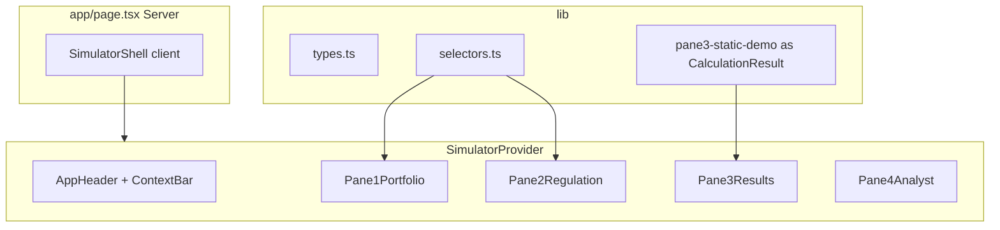

# 欧州CO₂シミュレーター — UIのみ完成計画

> **保存日**: 2026-05-21  
> **関連**: [eu-co2-simulator-grill-decisions.md](./eu-co2-simulator-grill-decisions.md)（グリル合意）  
> **フェーズ**: UI のみ（計算・保存・API は Phase 2）  
> **Pane 3**: 固定サンプル数値（入力変更に非連動）— ユーザー確認済み

## 実装 TODO

- [x] Next.js + Tailwind + shadcn/ui プロジェクトを new-tool に作成
- [x] types/constants/defaults/selectors・CalculationResult・pane3-static-demo を定義
- [x] SimulatorProvider + useSimulatorState（年別規制・行ID・名前付きupdater）
- [x] AppHeader + ContextBar + SimulatorShell（pageはServerのまま）
- [x] Pane1Portfolio: 2表切替・車種表・10行上限・BEV WLTP 固定
- [x] Pane2Regulation: 年次・プリセット・重量補正UI・詳細折りたたみ
- [x] Pane3（デモ視覚差別化・非色依存達成表示）+ Pane4（モックAI）
- [x] npm run build + hook/updater最小テスト + 手動UX確認

---

## 現状

- [new-tool](../) には本ドキュメントと `eu-co2-simulator-grill-decisions.md` のみ（アプリ未作成）
- 合意ドキュメントは **縦4分割・スクロール可能なカード型ダッシュボード**（[workspace-ui-kit](https://git.ai-driven-school-portal.com/ADS/workspace-ui-kit) の横4ペインとはレイアウトが異なる → **新規構成で実装**）

## UIフェーズのスコープ

| 含める | 含めない（次フェーズ） |
|--------|------------------------|
| Next.js プロジェクト初期化、`npm run dev` 動作 | `lib/calculations.ts` の本番計算 |
| 4 Pane の全入力・表示・操作（クライアント state） | localStorage 自動保存 |
| サンプル初期データ（汎用ラベル＋架空数値） | JSON エクスポート／インポートの実処理 |
| Pane 3：**固定サンプル数値**＋「計算は次フェーズ」注記 | LLM API・本番プロンプト送信 |
| v1対象外の注意（プール・エコイノベ）Alert | 重量補正の厳密な EU 公式との突合 |

**ユーザー確認済み**: Pane 3 は入力変更に連動させず、固定表示のみ。

---

## アーキテクチャ概要



- **`app/page.tsx` は Server Component のまま**、`components/simulator/SimulatorShell.tsx` + `SimulatorProvider` でクライアント境界を明示
- Pane 1〜2・4 は Provider 経由の state。**Pane 3 は `CalculationResult` 型の静的サンプルのみ**（state 非連動）
- レビュー反映: [§10 サブエージェントレビュー](#10-サブエージェントレビュー2026-05-21)

---

## 1. プロジェクト土台

**作業ディレクトリ**: `new-tool` リポジトリルート

1. `create-next-app`（App Router, TypeScript, Tailwind, `src/` なし構成で合意パス `components/panes/` と整合）
2. `shadcn/ui` 初期化（`lucide-react` 同梱）
3. 追加コンポーネント（CLI）:
   - `card`, `button`, `input`, `label`, `select`, `table`, `badge`, `alert`, `collapsible`, `checkbox`, `separator`, `scroll-area`, `skeleton`, `tooltip`, `toast`（プリセット適用フィードバック用）
4. `app/globals.css`: 社内ツール向けトーン（白背景・neutral/slate・達成=緑・未達=赤のセマンティック色）
5. `app/layout.tsx`: 日本語 `lang="ja"`、ツール名メタ

**参考**: workspace-ui-kit の shadcn 導入手順は参考にするが、**横4ペインの Workspace コンポーネントは流用しない**。

---

## 2. 型・定数・データ（Phase 2 契約を UI フェーズで固定）

### `lib/types.ts`

- `Powertrain`: `ICE_HEV` | `PHEV` | `BEV_SMALL` | `BEV_NORMAL`
- `VehicleRow`: **`id: string`**（UUID）, 車種名, PT, 販売台数, WLTP, 重量 kg — 数値は **`number | null`**（空欄は null）
- `PortfolioBundle`: `{ base2025: VehicleRow[]; base2026: VehicleRow[] }`（2表独立）
- `RegulationYear`: `2025` | `2027` | `2030`（拡張可）
- **`YearRegulation`（年別）**: 燃料クレジット, グリーン鉄, 小型EV係数, 罰金単価, `useManualTarget`, `manualTargetGPerKm`, `targetGPerKm`（年次表）
- `SimulatorState`: portfolios, `regulationsByYear: Record<RegulationYear, YearRegulation>`, `weightCoefficients: { a, m0 }`, activePortfolio, selectedYear
- **`CalculationInput` / `CalculationResult`**（Phase 2 用。`achievementRatePercent: number | null` で除算ガードを型表現）
- `PersistedSimulatorSnapshot`: `{ version: 1, savedAt, state }`（保存は Phase 2、型だけ先に定義）
- `AnalystRequestPayload`（Pane 4 将来用。UI では未送信）

※ 単一のフラット `RegulationScenario` は **採用しない**（年別合意・プリセット適用の手戻り防止）

### 新規ファイル

| ファイル | 役割 |
|----------|------|
| `lib/constants.ts` | `MAX_VEHICLES=10`, プリセット値, 暫定年次, a/M0 初期値, `STORAGE_KEY`, `// OPEN: §13.x` |
| `lib/defaults.ts` | `createInitialState()` — 5〜6行サンプル車種・年別規制初期値 |
| `lib/sample-data.ts` | 表示ラベル・Pane4 モック Markdown 文言（定数 import） |
| `lib/parse.ts` | `parseNonNegativeInt` 等（入力正規化） |
| `lib/selectors.ts` | `getActivePortfolio`, `getRegulationForYear`, `toCalculationInput`（スタブ）, `getDisplayTargetCo2`（UI 表示用スタブ） |
| `lib/pane3-static-demo.ts` | **`CalculationResult` を満たす固定サンプル**（未達デモ: 達成率 92.4% 等） |
| `lib/pane4-mock-response.ts` | 社内2種 Markdown（JAMA なし） |

---

## 3. ページレイアウト

`app/page.tsx` → `<SimulatorShell />` のみ

```
max-w-5xl mx-auto px-4 py-6 space-y-6
├─ AppHeader（タイトル・サンプル Badge・disabled Export/Import + Tooltip）
├─ Alert: 社内専用・試算目的
├─ Alert collapsible: プール・エコイノベ未対応（§3 誤解防止）
├─ ContextBar（sticky 候補）: [対象年] [ポートフォリオ: 2025/2026表] [計算: デモ固定]
├─ TOC（md+）: Pane1–4 アンカーリンク（Should）
├─ Pane1（Card + 共通 Pane ヘッダー）
├─ Pane2
├─ Pane3（デモ視覚: 左 amber ボーダー / opacity 弱化）
└─ Pane4
```

**Pane 共通ヘッダー**: 番号 + タイトル + 1行説明 + 右 Badge（サンプル / デモ / モック）

各 Pane: `rounded-xl border bg-card shadow-sm p-6`、見出し + lucide アイコン。

---

## 4. Pane 別 UI 仕様

### Pane 1 — `components/panes/Pane1Portfolio.tsx`

| 要素 | 実装 |
|------|------|
| ベース切替 | Select: 「2025年実績ベース」/「2026年予測ベース」→ **アクティブ表の参照先だけ切替**（2表は別オブジェクト） |
| 車種表 | shadcn `Table`、最大10行、**`overflow-x-auto` のみ**（表をラップ。ScrollArea は Pane4 用） |
| 列 | 車種名, PT Select（Badge 色分け）, 台数, WLTP（BEV: disabled + Tooltip「BEVは0固定」）, 重量 kg — **数値列右寄せ、単位はヘッダーに集約** |
| 行操作 | 追加ボタンに「残り n 枠」、10行で無効化 |
| フッター行 | 合計販売台数（実台数・スーパークレジット前） |
| サンプル明示 | Pane ヘッダー Badge「サンプルデータ（架空数値）」 |

### Pane 2 — `components/panes/Pane2Regulation.tsx`

| 要素 | 実装 |
|------|------|
| 対象年 | Select（年次表の行と連動） |
| 年次目標 | 年 × 目標 g/km の小さな編集表 |
| プリセット | 「欧州委員会案」「欧州議会修正案」ボタン → **選択中の対象年の行のみ**パラメータ一括セット（95/0/0/1.0 と 85/1.5/0.5/1.3） |
| シナリオ入力 | 燃料クレジット, グリーン鉄, 小型EV係数, 罰金単価（初期 €95） |
| セクション分割 | `Separator` + 小見出し: 対象年と年次 / シナリオ / 重量補正（プレビュー） / 詳細係数 |
| プリセット FB | 適用時 **toast**: 「{年}年のパラメータのみ更新しました」 |
| 重量補正 | DescriptionList 3値: 加重平均重量 / 補正後目標 / 実効目標 — **サンプル固定** + 注記「Pane1から算出（次フェーズ）」 |
| 手入力上書き | Checkbox ON で目標 g/km Input 有効。表示の大きな目標は `getDisplayTargetCo2(state)` スタブ |
| 詳細設定 | `Collapsible`: 係数 a, M0 |
| 対象外 | エコイノベ・プールのフィールドは **置かない** |

**§13 暫定（UI フェーズ）**: プリセットは **選択年の `YearRegulation` のみ更新**（クレジット・係数・年次 `targetGPerKm`）。重量補正表示は固定。Phase 2 で `applyPreset` を1箇所に集約し、95/85 と自動目標の整合をグリル確定。

### Pane 3 — `components/panes/Pane3Results.tsx`

- **デモモード視覚（Must）**: 左 `border-amber-500`、`Badge: デモ表示（入力未連動）`、指標は `opacity-60` + 「参考値」
- 固定コピー（Alert 上）: 「Pane1・2の変更は反映されません。表示はサンプル計算結果です。」
- **ヒーロー 3列 grid**: 達成率 | 超過/猶予 g/km | 想定罰金 € — 緑赤は達成率・超過のみ、罰金は中立色
- **StatusStrip**: `CheckCircle2`/`XCircle` + 文言「達成見込み」「未達見込み」（**色だけに依存しない**）+ `aria-label`
- 補助指標: 2×2 小カード（フリート平均・実質排出・目標CO₂・総カウント台数）、`Collapsible` 可
- `CalculationResult` から表示（静的インスタンス）

### Pane 4 — `components/panes/Pane4Analyst.tsx`

- ボタン「AIに分析・対策を検討させる」+ `Badge: モック`
- 未実行時: 空状態 + 「サンプル分析を表示」副ボタン（Could）
- クリック → Skeleton 1.5–2s → `ScrollArea` max-h 80vh に固定 Markdown
- フッター: APIキー未設定時はモック応答
- Phase 2: `buildAnalystPromptPayload(input, result)` 型のみ先に定義

### 共通 — `components/layout/AppHeader.tsx`

- ツール名: 欧州CO₂規制シナリオ・シミュレーター
- v1 対象外 Alert（プール・エコイノベ）
- JSON Export/Import: **disabled** + Tooltip 統一文案「JSON 入出力は計算・保存フェーズで有効化」+ `aria-disabled`
- ヘッダーに `Badge: 保存は次フェーズ`（Could・localStorage 未実装の明示）

---

## 5. 状態管理

`components/simulator/SimulatorProvider.tsx` + `hooks/useSimulatorState.ts`

- **`setState` を露出しない**。`actions`: `updateVehicleRow`, `addVehicleRow`, `removeVehicleRow`, `setActivePortfolio`, `setSelectedYear`, `applyPreset(presetId, year)`, `updateYearRegulation`, …
- **不変更新**（配列・`regulationsByYear` のコピー）。`VehicleRow.id` で行キー安定
- BEV → WLTP 0、10行上限、プリセットは **selectedYear の `YearRegulation` のみ**
- Pane は **`lib/selectors.ts` 経由**で読み取り（計算式を Pane に書かない）
- **Pane 3 には state を渡さない**
- **最小テスト（Should）**: Vitest で updater 3ケース（10行上限・BEV WLTP・プリセット他年非更新）

---

## 6. ファイル構成（合意どおり）

```
app/
  layout.tsx
  page.tsx              # Server → SimulatorShell
  globals.css
components/
  layout/AppHeader.tsx
  layout/ContextBar.tsx
  simulator/SimulatorShell.tsx
  simulator/SimulatorProvider.tsx
  panes/Pane1Portfolio.tsx … Pane4Analyst.tsx
  panes/PaneSectionHeader.tsx   # 共通 Pane ヘッダー
  ui/                           # shadcn
lib/
  types.ts
  constants.ts
  defaults.ts
  parse.ts
  selectors.ts
  sample-data.ts
  pane3-static-demo.ts
  pane4-mock-response.ts
  utils.ts
hooks/
  useSimulatorState.ts
docs/
  eu-co2-simulator-grill-decisions.md
  eu-co2-simulator-ui-plan.md   # 本ファイル
```

`lib/calculations.ts` は **Phase 2 で新規作成**（UIフェーズでは作らない）。

---

## 7. 実装順序

1. Next.js + shadcn + グローバルスタイル + Vitest（1本）
2. `types` / `constants` / `defaults` / `selectors` / `pane3-static-demo`
3. `SimulatorProvider` + `useSimulatorState` + updater テスト
4. `AppHeader` + `ContextBar` + `SimulatorShell`
5. Pane 1 → 2 → 3（デモ視覚）→ 4
6. 手動: 文脈バー・デモ Pane3 錯覚防止・TOC・表横スクロール・プリセット toast

---

## 8. 完了の定義（UIフェーズ）

- [ ] 4 Pane が縦に並び、スクロールで一通り操作できる
- [ ] Pane 1: 2025/2026 の2表切替・10行・全列・サンプル Badge
- [ ] Pane 2: 対象年・年次表・プリセット・折りたたみ係数・手入力上書き
- [ ] ContextBar: 対象年・ポートフォリオ表・計算デモ固定が常時見える
- [ ] Pane 3: デモ視覚差別化・非色依存達成表示・固定サンプル・未連動コピー
- [ ] Pane 4: モック AI・オフラインバッジ
- [ ] 年別 `regulationsByYear`・行 `id`・`CalculationResult` 整合
- [ ] SUBARU実車名・実数値なし、JAMA文言なし
- [ ] `npm run build` + updater 最小テスト合格

---

## 9. 次フェーズ（参考・今回は実装しない）

1. `lib/calculations.ts`: 合意§7の式 + 重量補正 + 対象年連動
2. Pane 3 を state + calculations に接続（除算ガード含む）
3. localStorage + JSON import/export
4. Pane 4 API Route（`.env.local` 任意送信）

§13の未決（実質排出0、プリセットと重量補正の整合、JSONスキーマ等）は **計算フェーズ前に短いグリル or 定数コメントで確定**。

---

## 10. サブエージェントレビュー（2026-05-21）

UI/UX デザイナー・シニア FE の2名レビューを反映済み（上記 §2–§8 の追記がその内容）。

### 10.1 UI/UX — 主な指摘

| 優先度 | 内容 |
|--------|------|
| **Must** | グローバル ContextBar（対象年・表・計算状態） |
| **Must** | Pane3 デモ視覚（amber ボーダー・Badge・opacity 弱化）で「入力未連動」を誤解させない |
| **Must** | Pane 共通ヘッダー、法規スコープ Notice（プール/エコイノベ） |
| **Should** | Pane1 表UX（右寄せ・単位・PT Badge・BEV Tooltip）、Pane2 セクション分割・プリセット toast |
| **Should** | 達成表示をアイコン+文言で非色依存、ページ内 TOC |
| **Could** | Pane4 空状態、保存「次フェーズ」Badge |

**最大リスク**: 触れる Pane1/2 と動かない Pane3 が並ぶと、スクリーンショット1枚で「計算済み」と誤解されやすい。

### 10.2 エンジニア — 主な指摘

| 優先度 | 内容 |
|--------|------|
| **Must** | 規制 state を **年別 `Record<Year, YearRegulation>`** に（フラット `RegulationScenario` 回避） |
| **Must** | `VehicleRow.id`、名前付き updater、不変更新 |
| **Must** | `CalculationInput`/`CalculationResult` と `pane3-static-demo` の構造一致 |
| **Must** | `lib/selectors.ts` の `toCalculationInput` スタブ、`SimulatorProvider` でクライアント境界 |
| **Must** | `lib/constants.ts` にプリセット・§13 OPEN コメント |
| **Should** | `defaults.ts`, `parse.ts`, `PersistedSimulatorSnapshot`, Vitest 最小テスト |
| **Could** | `lib/format.ts`, バレル export |

**最大リスク**: UI フェーズで state 形を誤ると Phase 2 が全面リファクタになる。

### 10.3 レビュー後の判断（計画への取り込み）

- Pane3 はユーザー選択どおり **静的のまま**。ただし **`CalculationResult` 型のサンプル**として表示し、Phase 2 で差し替え可能にする。
- 重量補正の数値は UI フェーズでは **固定表示 + 注記**、計算接続は Phase 2。
- `app/page.tsx` を Server のまま維持する（エンジニア Must）。
